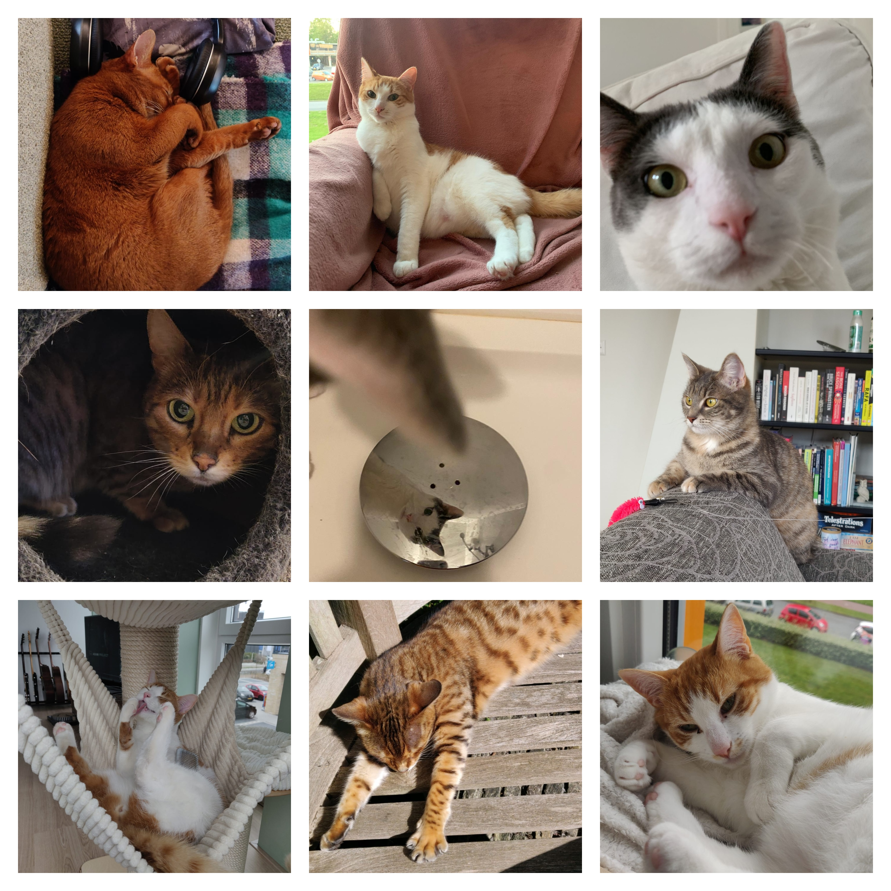

# Proposal: Cats :)
Example:  

## Problem statement
Feral cat colonies reproduce extremely quickly and are an invasive species in most parts of the world which makes it imperative to control the number of cats in an area so they don't destroy the ecosystem they are in. 

_Research question:_ What factors influence the number of cats to get out of hand and how can their population be minimized?

 

## Solution 
This project will simulate a grid with cat colonies which can get food either from wildlife or human homes. Additionally, homes will be putting out traps to neuter them and minimize population growth. This can provide insight into what measures should be taken in order to minimize cat population.

### Agents
#### *Cats*
  - age
  - gender
  - fertility
  - colony
  - max distance from home
#### *Homes*
  - ammount of food
#### *Cat trap*
  - home
  - max distance from home
  - chance of trapping (already neutered) cat -> neutering
#### *Food*
  - ammount of food

 

### Description of events
For every tick, cats will be able to move, mate or eat.
Houses can put out x food and cat traps can trap/neuter cats.

Every cat will belong to a colony that has an area in which they live and peruse outside to look for food. If a steady food source is found the colonies' home can shift. 

Cat traps will belong to a home outside of which they will go max x distance to trap and neuter cats, therefore putting out food will increase chances of trapping.
  

### Expected complications
The visualisation is the part I'm least looking forward to hahaha. Other than that probably implementing the logic for exchange of information between cats to displace the colony. 
  

## Sketch

I will leave you with a final collage.
 

 

Thank you for your consideration.